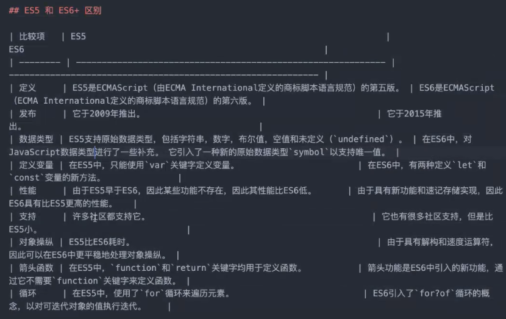

##  JavaScript

js 解释型，即时编译的语言

###  js的应用场景

- js 配合html/css 构建前端
- Nodejs （nodejs+npm）
  - 注意，没有浏览器相关的变量和 api

####  JavaScript的基本数据类型 和 常用的 api

##  js语法

- 语句和表达式

```javascript
var num;
var str = "hello javascript";
var a,b; 
a = 1;
b = 2;
var c = a +b; 


```

- 块和流程控制语句

```js
if (condition){
  // do something
}
for (var i=0; i<arr.length; i++){
  // do something
}
```

- 注释

```js
// 单行注释
/*
多行注释
多行注释
*/

```

###  JavaScript数据类型

两种数据类型： 1. 基础数据类型； 2.对象

#####  1. 基础数据类型 -7 种

- undefined: `typeof xxxx === "undefined"`
- null
- boolean
- number
- string
- BigInt 表示范围要远大于number
- Symbol
- (var 动态类型)（typeof 变量类型判断）全局变量 es6用let和const
- 

#####  2.对象类型(复杂数据类型，数组，字典，等等，需要通过其他的方式 判断 和定义？)

Object  `typeof `

- array: [1,2,3]

- date

- Map: key value

- function:

##### 3.类型转换


###  JavaScript 常用 API

- Date:

```
Date.now()
new Date()
new Date('2000/10/1')
```

- console.log()

```
可以打印一些东西
```

- alert

```
弹窗提示
```

- document

- window （特别重要）
- setTimeout/setInterval

```js
// 5s 后打印语言， settimeout 设置延时, 只执行一次
setTimeout(function(){
console.log("假期快没了")；
},5000);

// 定时; 
setInerval(function(){
  console.log("我要定时");
}, 1000);

// 每1s都执行一次打印输出
```


- JSON.parse/JSON.stringify （可以转换，也可以实现 深拷贝）

```js
var obj={
  name: "hello",
  age: 28,
}
obj.toString(); //不能转化成字符串
const obj_str = JSON.stringify(obj); // 可以转换成字符串
var obj_clone = JSON.parse(obj); // 可以将上一步的操作 返回去


obj_clone === obj; // 这两个不是一个东西， 
var obj2 = obj;  //  这种操作不可以，指针指向一样
obj2.age +=1

// 然后obj.age 也会跟着发生变化

```

###  ES6 + 语法

	

var/let/const

ES5 var

ES6+ **let/const和var**

```js
var num=1;
let num=1;
const num=1;
```

1 - 重复声明

```js
var name = 'javascript';
// 中间有几千行代码
// .... 
var name = ['name1', 'name2'];
//  重复声明 会导致 其中一个 函数name失去 作用
```

```js
let name = "asdasdasd";
/*
....
*/
let name =  ['name1', 'name2'];  // 后面定义的 name 会报错，因为函数变量定义重复存在，

const pi = 3.14;
//。。。。
const pi = 3.21312312;   // 后面定义的 pi 会报错，因为函数变量定义重复存在，
```

2 - 块级作用域

```js
let/const 是块级作用域;

var 是全局作用域;

```

3 - 应用问题 -- 闭包

```js
var arr = [];
for (var i=0; i<5; i++){
  arr[i] =  function(){
    console.log(i);
  }
}
// 会输出五个5
arr[0]();  //  函数是 console.log(i); i=4+1
arr[1]();  //5
arr[2]();  //5
arr[3]();  //5
arr[4]();  //5
```

```js
var arr = [];
for (let i=0; i<5; i++){
  arr[i] =  function(){
    console.log(i);
  }
}

arr[0]();  //0
arr[1]();  //1
arr[2]();  //2
arr[3]();  //3
arr[4]();  //4
```

**不用es6,es5能不能解决？ **立即执行函数

```js
var arr = [];
for (var i=0; i<5; i++ ){
  (
  function(i){
    arr[i] =  function(){
    console.log(i);
  	}
  }
    )(i);
}

```

>  总结: ES6+ 的代码，不建议使用 var，用let/const去代替。
>
> - let 定义的是变量
> - const 定义是常量， （不能赋新的值）

###  ES6+ 其他特性

- 箭头函数

```js
function add(a,b){
  return a+b;
}

const add_arrow = (a,b) => a+b;
// 特定情况下，比较方面，
const sayhello = (first, last) => {
  const name = first+last;
  return name;
}

```

- 模版字符串

```js
const sayhello = (first, last) => {
  const name = first+last;
  console.log("hello", name);
  console.log(`hello ${name}`);
}
sayhello("a","b")
```

```js
const result = "hello, my name is" + firstname + ' ' + lastname + " , my age is "+ age;

// ....

```

- 扩展运算符

```js
let obj = {
  name: 'hello',
  age=20,
}

const obj_copy = {...obj};  // 深拷贝

//扩展数组
const arr=[1,2,3];
const arr_copy = [...arr];
arr_copy.push(4);
// arr_copy = [1,2,3,4];
```

- set 对象， 快速处理去重逻辑，

```js
const arr = [1,2,3,4,1,2,3,4];
new Set(arr);
```

数组去重问题:

```js
function uniqueArr(arr){
  // do something
  return newArr;
}

```

```js
const arr = [1,2,3,4,1,2,3,4];
const arrSet = new Set(arr);

console.log(arr instanceof Array); //true
console.log(arrSet instanceof Array); //false
// 输出是 {1,2,3,4}
```

- Array.from / Array.isArray
  - Array.from -  把 类数组对象 变成 数组
  - set  是一个 类数组对象
  - Document NodeList 是一个 类数组对象


​	-  Array.isArray([])

```JS
Array.from(new Set([1,2,3,4,1,2,3,4])); // 去重，并且转换成数组

Array.isArray([]) // 判断是否为array 数组对象
```

##  Promise 对象 + 处理异步 （es6+）

- promise 是es6 提供的解决**异步编程**的一个方案

**异步编程**：JS 是单线程的。setTimeout setInterval 

```js
setTimeout (()=>{
  console.log("print something");
  setTimeout(()=>{
    console.log("second thing to do");
    setTimeout(()=>{
    	console.log("third thing to do");
  	},1000);
  },3000);
}, 5000);
```

- es5 的异步处理：

  - ```js
    setTimeout (()=>{
      console.log("print something");
      setTimeout(()=>{
        console.log("second thing to do");
        setTimeout(()=>{
        	console.log("third thing to do");
      	},1000);
      },3000);
    }, 5000);
    ```

- promise语法

  ```js
  new Promise(function(resolve reject) {
    // do something
  }):
  
  new Promise((resolve, reject)=>{
    if (成功了){
      resolve(data);
    }else{
      reject(error);
    }
  });
              
  ```

- promisew 接收一个函数，返回一个对象，有两个比较重要的方法

  - .then ：成功之后，获取 resolve 的数据
  - .catch： 失败之后，获取的是 reject error


##  js 操作 DOM

###  获取DOM

- document.getElementById
- ...

###  创建DOM

```JS
const dom = document.createElement("h1");
dom.classList.add("red-text");
dom.id = "title";
console.log(dom);

```

###  更新DOM

- innerHTML
- innerText

```JS
const dom = document.createElement("h1");
dom.classList.add("red-text");
dom.id = "title";

dom.innerText = "我是标题"
dom.innnerHTML = '<p>woshi标题</p>'

console.log(dom);
```

###  插入DOM

- appendChild

```js
const dom = document.createElement("h1");
dom.classList.add("red-text");
dom.id = "title";

dom.innerText = "我是标题"
dom.innnerHTML = '<p>woshi标题</p>'

document.body.appendChild(dom);
```

- insertBefore(newNode, referNode)

```js
const dom = document.createElement("h1");
dom.classList.add("red-text");
dom.id = "title";

dom.innerText = "我是标题"
dom.innnerHTML = '<p>woshi标题</p>'

const firstChild = document.getElementById("first-name");

document.body.insertBefore(dom, firstChild);

```

###   删除 DOM

- removeChild

```js
document.body.removeChild(firstChild);
```


##  存储

###  localStorage

前端永久性存储

- setItem(key, value)

- > value 必须是字符串， JSON.stringify/JSON.parse

- getItem(key)

- removeItem(key) 

- > 阶段性练习：dotolist


##  异步请求

- XHR
- fetch
  - 基于promise实现的
  - 


