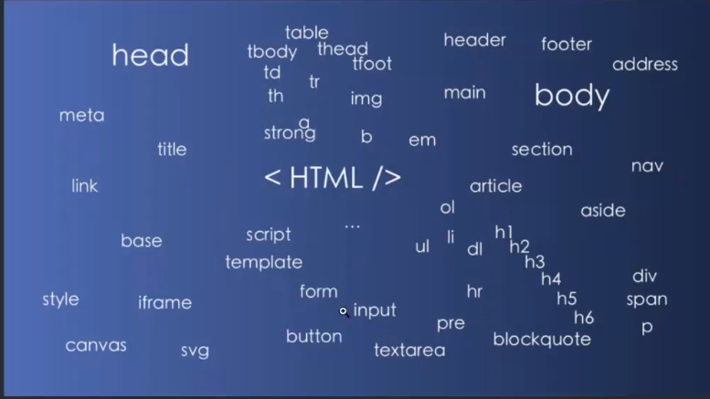

##  HTML

- html 是一种文件 `.html`

- html 是一种语言，前端三剑客之一（js/css/html）

###  HTML 标签

```
标签是html最核心的内容

```

####  html标签规范、



```
1. 一律使用<>尖括号，
2. 标签全部小写字母
3. 标签大多是成对存在的 
```

> 4. 标签不需要成对的特殊情况：meta, hr, br, img1. <html>标签

**<!DOCTYPE HTML>**

```
用来定义html的规范，目前都是html5（最新的标准）
```

**html 标签**

```
页面都在<html>内书写
一个页面理论上，只应该有一个 html标签
所有东西都应该包含在标签 <HTML></HTML>里
```

****

**head 标签 - 网站的名片**

```
<head>里面的东西
文档的原数据标签

 相当于告诉浏览器，我这个页面是干什么的
```

- link标签，：

    - 1.帮助web设置icon
        - `<link rel="icon" href="#"/>`
    - 2.帮助我们设置外联 CSS/js
        - `<link rel="stylesheet" href=""/>`

- style 标签：

    - 设置文档的样式	`<style><style>`

- meta 标签：

    - 告诉网站这个页面是干什么的，。对于网页显示没有帮助

- **body 标签：**

    - **文本类型的标签**

        - 1. h1～h6：标题
        2. p：`paragraph` 表示一个段落（<p></p>和<p></p>之间表示不同的段落）
        3. span： 一段文字（<span></span>和<span></span>之间， 不能自动换行)
            - span可以对一段话中的某句话进行style属性设置

    - **文本修饰类的标签**

        - b 加粗
        - i 斜体
        - u 下划线

    - **序表类 标签：**

        - ul ： 无序列表（和li搭配）
        - ol： 有序列表（和li搭配，有排序标签）
        - li： 列表项
        - table
            - th定义表格的表头（head）（表格的第一行）
            - tr定义表格的行（row）
            - td 定义表格的单元
            - thread 定义表格页眉，表的第一行
            - tbody 定义表格的柱体， 表格的主体内容
            - tfoot 定义表格的页脚， 最后一行
            - caption 定义表格的标题，表格的名字
            - colgroup 定义表格列的组？？
            - col 定义表格列的属性

    - **事件类 标签：**

        - a 标签： 跳转到指定链接页面

            - **a 标签，可以设置新窗口打开** `<a target="_blank" href="#">`

        - button 标签：处理点击事件

            - `<button onclick="say hello">submit </button>`

              ```html
              <button onclick="say hello">submit </button>
              <script>
                  function satHello(){
                  alert("hello everyone")
                } 
              </script>
              ```

        - **表单类 标签**

            - 1. 文本框
            2. 单选框
            3. 复选框
            4. textarea 多行文本
            5. <label>: 定义了 <input> 元素的标签，一般为输入标题

        - **div 标签**： 万能标签？？

            - 什么时候用： **不知道该用什么标签的什么就用div标签**

        - **img 标签**

            - 通过 src属性 加载本地/网络 的图

        - **音频，视频**

        - link 标签是加载 css 的

        - script 标签： 加载 javascript

            - 1- 文档内

              ```javascript
              <script>
                </script>
              ```

            - 2- 文档外的： js 文件引入html

            - 3- 网络的。bootstrap

            - > [建议]： script 标签放在 </body> 前面

        - iframe 标签；

            - 把其他的页面 嵌入 当前的页面
            - 不建议的使用，不必要的情况，不使用iframe

##  CSS

层叠样式表（cascading style sheets）， 修饰 html 的。

- 页面好不好看
- 页面兼容性好不好。

###  使用姿势

- 外部引入
    - 1. 文档外工程内
    2. 网络中
- 内部引入
    - 1.`<style>标签引入`
    - 2.style属性直接写 `<p style="color: red;"></p>`

**css 规则**

```css
[selector]:{
  [prop]:value;
}
```

- 全局 selector

  ```css
  *{  margin:0;  padding:0;}消除浏览器默认样式
  ```

- 标签选择器

    - 通过html标签，匹配符合条件的所有的dom

  ```css
  p{  border: 1px red solid;}div{  background-color: #fff;}
  ```

- 类选择器 - 日常开发中，用得最多

- id 选择器

- **伪类选择器**

    - hover(link, visited, hver, active)： focus

      ```css
      <style>.pink-text:hover {  }</style>
      ```

- **伪元素选择器**

  ```css
  :: marker 更改li前面的序号，比如，换成svg图片的样式:: before        p::before {          content: "!!!";        }:: adfter				p::after {          content: "!!!";        }
  ```


##  CSS框架

- bootstrap
- bulma

